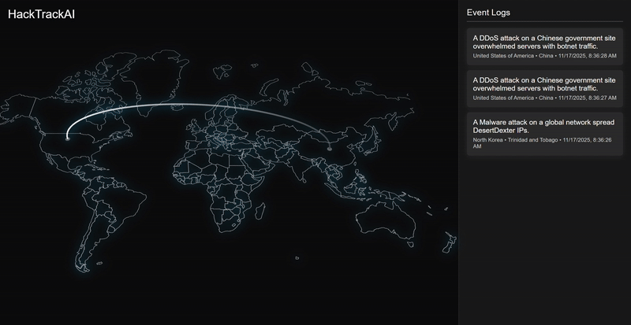

# HackTrackAI

**HackTrackAI** is an AI-powered **cyber threat intelligence visualization platform** that tracks and summarizes global cyberattacks in real time.

The platform integrates:
- A **FastAPI backend** that continuously ingests live threat intelligence from **AbuseIPDB** and **AlienVault OTX** public APIs.  
- A **Mistral AI LLM** that interprets raw event data into concise, human-readable summaries.  
- A **React + DeckGL frontend** that visualizes attacks as animated arcs and glowing flares across the world map.  
- An **automated CI/CD pipeline** (Docker + GitHub Actions) that builds, tests, and deploys containerized services to **AWS ECS**.

Users can monitor live cyber activity, view real-time summaries, and interact with a constantly updating world map of global attack patterns.

---
